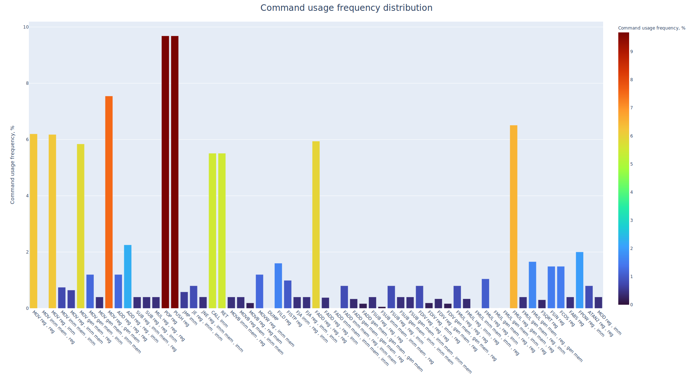

#Benchmark
В этой директории представлена программа на ассемблере, реализующая трассировку лучей. Данная программа будет выступать в роли бенчмарка архитектуры процессора.
## Interactive part
Идея взята вот [тут](https://github.com/DinoZ1729/Ray), также использовался [сайт](https://www.scratchapixel.com/lessons/3d-basic-rendering/minimal-ray-tracer-rendering-simple-shapes/ray-sphere-intersection) для реализации ray tracing.

  

## Performance Analysis
В качестве количественной оценки производительности пример количество инктрукций, которые требуются для генерации одного кадра. 

**тут таблица с результатами тестов**

Для улучшения производительности зададимся вопросом, какой минимальный набор инструкций следует добавить в архитектуру, чтобы получить максимальный прирост производительности.
В данный проект был добавлен профилировщик, который собирает информацию о том, какие инструкции выполнялись по ходу отрисовки кадра. Обратимся к данным и построим несколько графиков,
отображающие частотность использования некоторых инструкций процессора, а также и график наиболее частоиспользуемых четверок команд.

**Распредение частотности использования команд процессора**

  

**Распредение частотности использования четверок команд процессора**

<table>
  <thead>
    <tr>
      <th align="center">Распределение частот</th>
      <th align="center">Полная диаграмма</th>
    </tr>
  </thead>
  <tbody>
    <td>
      <table>
        <thead>
          <th align="center">Частота появления, %</th>
          <th align="center">Команды</th>
        </thead>
        <tbody>
          <tr>
            <td>6.560</td><td> FMUL reg , gen mem  FADD reg , reg  MOV reg , gen mem  FMUL reg , gen mem  </td>
          </tr>
          <tr>
            <td>6.560</td><td> FADD reg , reg  MOV reg , gen mem  FMUL reg , gen mem  FADD reg , reg  </td>
          </tr>
          <tr>
            <td>6.560</td><td> MOV reg , gen mem  FMUL reg , gen mem  FADD reg , reg  MOV reg , gen mem  </td>
          </tr>
          <tr>
            <td>4.541</td><td> MOV reg , reg  FADD reg , reg  FADD reg , reg  POP reg  </td>
          </tr>
          <tr>
            <td>4.541</td><td> XOR reg , reg  MOV reg , reg  FADD reg , reg  FADD reg , reg  </td>
          </tr>
          <tr>
            <td>4.541</td><td> FMUL reg , gen mem  FMUL reg , gen mem  FMUL reg , gen mem  XOR reg , reg  </td>
          </tr>
          <tr>
            <td>...</td><td> ... </td>
          </tr>
        </tbody>
        </table>
    </td>
    <td>
      
    </td>
  </tr>
  </tbody>
</table>

